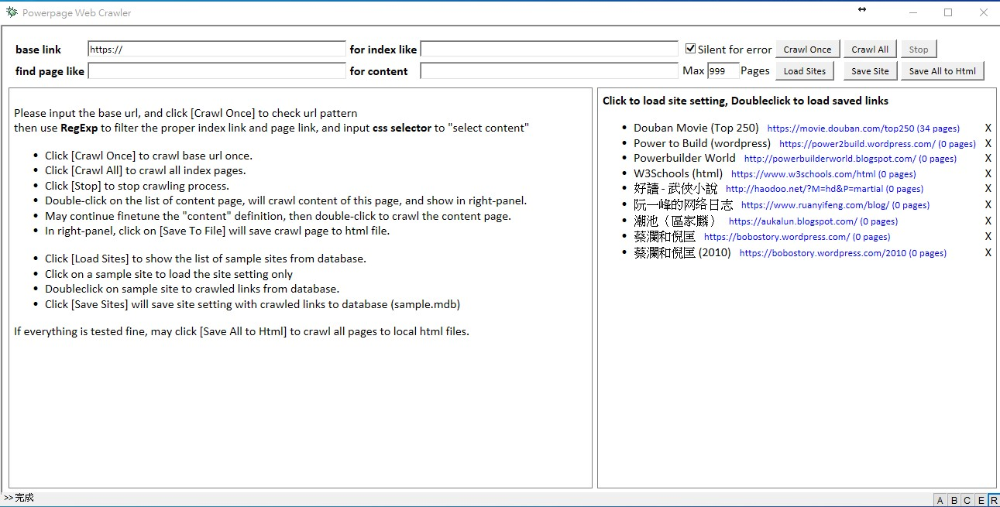

# Powerpage Web Crawler

``Powerpage Web Crawler`` is portable lightweight web crawler using [**Powerpage**](https://github.com/casualwriter/powerpage). 
 
It is a simple html/js application demonstrating developing application using [Powerpage](https://github.com/casualwriter/powerpage). 

## Installation & Run

* No installation is needed, Just download and run ``powerpage.exe``.
* The package is same as [Powerpage](https://github.com/casualwriter/powerpage), only ``powerpage.ini`` is revised.

## User Guide

#### Test Crawling

* Input the base url first.
* Click [Crawl Once] to crawl the base page 
* find out the pattent of index page (regexp)
* find out the pattent of content page (regexp)
* open Chrome and goto content page, find out the css selector for crawling content

#### Start carwling

* Click [Crawl Once] to crawl base url once.
* Click [Crawl All] to crawl all index pages.
* Click [Stop] to stop crawling process.
* Double-click on the list of content page, will crawl content of this page, and show in right-panel.
* May continue finetune the "content" definition, then double-click to crawl the content page.
* In right-panel, click on [Save To File] will save crawl page to html file.* 

#### Work with database

* Click [Load Sites] to show the list of sample sites.
* Click on a ssite to load the site setting and links.
* Doubleclick on a sample site to load setting and [Crawl Once]
* Click on [x] to delete site from database
* Click [Save Site] to save site setting and crawled links to database

If everything is tested fine, may click [Save All to Html] to crawl all pages to html files.

## Source Code

It is single html/js program ([pp-web-crawler.html](source/pp-web-crawler.html)) about 250 lines. 

## Modification History

* 2021/06/28, v0.30, first version.
* 2021/07/02, v0.35, add sample sites.
* 2021/07/07, v0.38, crawl all site to local file
* 2021/07/09, v0.40, save links to db, and misc enhancement

## License

MIT
